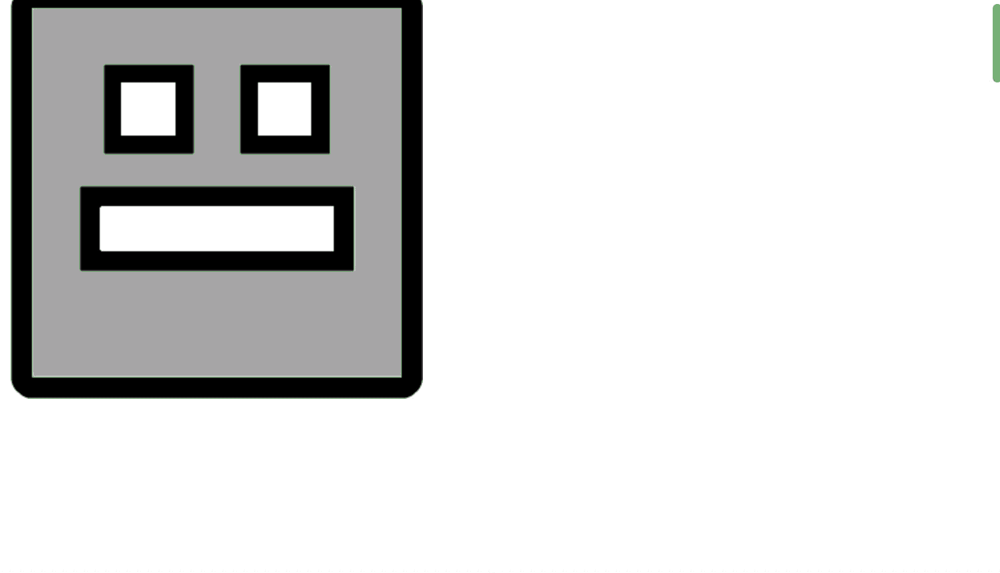

Lozad [](https://badge.fury.io/js/lozad)
=====
*Advanced Lazy Loader using Intersection Observer API*
***

lozad.js is a light-weight library to lazy load elements using JavaScript.

It is written with an aim to lazy load images, ads, videos or any other element using the recently added [Intersection Observer API](https://developer.mozilla.org/en-US/docs/Web/API/Intersection_Observer_API) with tremendous performance benefits.

Yet another Lazy Loading JavaScript library, why?
-----
Existing lazy loading libraries hook up the scroll event or use a periodic timer and call getBoundingClientRect() on elements that need to be lazy loaded. This approach, however, is painfully slow as each call to getBoundingClientRect() forces the browser to re-layout the entire page and will introduce considerable jank to your website.

Making this more efficient and performant is what [IntersectionObserver](https://developers.google.com/web/updates/2016/04/intersectionobserver) is designed for, and it’s landed in Chrome 51. IntersectionObservers let you know when an observed element enters or exits the browser’s viewport.

Demo
-----
[View demo](https://apoorv.pro/lozad.js/demo/index.html)



Installation
-----

**lozad.js** is *just 569 bytes* minified & gzipped. It has NO DEPENDENCIES :).

- Yarn: `yarn add lozad`
- NPM: `npm install lozad`
- Bower: `bower install lozad`
- [Download zip](https://github.com/ApoorvSaxena/lozad.js/archive/master.zip)

**Note**: **lozad.js** supports AMD and commonJS module pattern out of the box.

Usage
-----

```
new Lozad(); // lazy loads images with selector class as 'lozad'
```
with custom options:
```
new Lozad({
    selectorClass: 'lozad', // for identification of images to lazy load
    rootMargin: '10px 0px', // syntax similar to that of CSS Margin
    threshold: 0.1 // ratio of image convergence
})
```
Reference:
- [IntersectionObserver options: rootMargin](https://developer.mozilla.org/en-US/docs/Web/API/IntersectionObserver/rootMargin)
- [IntersectionObserver options: thresholds](https://developer.mozilla.org/en-US/docs/Web/API/IntersectionObserver/thresholds)

give custom function definition to load element:
```
// Initialize Lozad
let lozad = new Lozad();

lozad.load = function(el) {
	console.log('loading element');

	// Custom implementation to load an element
	// e.g. el.src = el.dataset.src;
}
```

Browser Support
-----

Available in [latest browsers](http://caniuse.com/#search=intersection). If browser support is not available, then make use of this [polyfill](https://www.npmjs.com/package/intersection-observer).

Contributing
-----

Interested in contributing features and fixes?

[Read more on contributing](./CONTRIBUTING.md).

Changelog
-----

See the [Changelog](https://github.com/ApoorvSaxena/lozad.js/wiki/Changelog)

License
-----

Copyright (c) 2017 Apoorv Saxena, https://apoorv.pro
Licensed under the [MIT license](http://opensource.org/licenses/MIT).